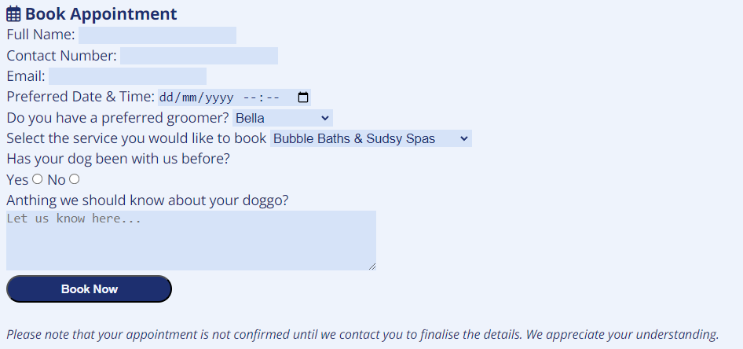

# Fuzzy Paws Dog Grooming

The [Fuzzy Paws Dog Grooming](https://catgriffin85.github.io/project-portfolio-1-fuzzy-paws/) project is a website for a small dog grooming business. The website provides information to customers about the services offered by the shop and allows customers to request an appointment online via a booking form. Customers can also see images of dogs that have been groomed in the grooming shop, how the business started and information about the team that work there.

## Features

* Header
    * Centered at the top of the page in the header is the company name with a pawprint icon. 

* Navigation Bar
    * The navigation bar has three links - Home, Book Appointment and About Us 
    * The navigation links are centered and feature on the top of all three pages.
    * On larger screens the links are shown alongside each other and on smaller screens they are listed underneath each other. 

* Main Page 

    * This is the landing page and starts with a fun and friendly introduction to the dog grooming shop.

    * The main page provides a list of services that are offered by the shop and includes a short description of each service.

    * Below the list of services is a call to action button inviting customers to book an appointment with one of the dog groomers. This button links to the Book Appointment page.

    * Included at the bottom of the main content are three images of dogs being groomed to show customers what they can expect when they use the service.

* Footer

    * The footer section invites customers to follow the shop on their Facebook and Instagram pages and offers an insight into what goes on in the shop during the dog grooming process.
    * Links to Facebook and Instagram open in a new tab.

* Book Appointment Page

    * The first section of the Book Appointment page provides customers with details of opening hours for the shop. 

    * Next is a form for customers to complete which allows them to request an appointment date and time, groomer and service.
    * A Book Now button submits the form.
    * Below the Book Now button is a disclaimer to advise customers that their appointment is not confirmed until they are contacted by the shop. 

    * Below the form there is an option for customers to phone the shop if they would prefer to book an appointment over the phone instead of an online form. This gives customers a choice to speak directly to someone if they are not comfortable using online forms.

    * Below this the address of the shop is provided so customers know where to drop their dog off on the day of their appointment.

* About Us Page

    * This page gives a brief lighthearted overview on where the idea for a dog groomers came from and how it was set up.

    * And finallly there is an introduction to the groomers working in the shop and includes some images of them grooming. 

## Testing

* Lighthouse
    * I ran my website through Lighthouse to check Performance, Accessibility, Best Practices and SEO. All passed with scores of 97 or greater.

* Page Links
    * I tested all my links on the Nav Bar and the call to action button on the main page to ensure they were all working and redirecting to the correct pages on the website.
    * I tested the social media links in the footer were working and opening in a new tab.
    * I tested the appointment booking form and confirmed all the boxes were validated, only one radio button was selected and the submit button was working correctly.

* HTML
    * I ran my HTML code through the W3C validator and no errors were found.

* CSS
    * I ran my CSS code through the W3C validator and no errors were found.

## Bugs
There was a bug causing an error in the width of the navigation bar and the footer, they were wider than the header and the main content section. I tried fixing it by going back over videos in the course and using google to try find a fix but nothing I tried worked. I spoke to my mentor about it during our mid project meeting and he identified that it was down to the margins. To fix the issue I used the CSS to give a general margin to all elements on my page and removed margins from individual elements.

No unfixed bugs

## Deployment

* Git Commit
    * This project was created in Gitpod and pushed to GitHub to the repository [project-portfolio-1-fuzzy-paws](https://github.com/catgriffin85/project-portfolio-1-fuzzy-paws)
    * git add . and git commit were used throughout the project to push the code to my repository. 
    * I used descriptive and meanful messages when using git commit and commited often.

* Deployment to GitHub
    * The steps used to deploy were as follows:
        * In the GitHub repository, navigate to the Settings tab.
        * From the source section drop-down menu, select the Master Branch.
        * Once the master branch has been selected, the page will be automatically refereshed with a detailed ribbon display to indicate the successful deployment.

## Credits
* A very big thank you to my Mentor who was so incredible helpful and really took the time to go through everything with me. 

* Content
    * The icons used throughout the website were taken from [Font Awesome](https://fontawesome.com/)
    * The social media links just direct to Facebook and Instgram and not specific pages as this business is fictional.
    * The favicon used in the title of the page and it's code was taken from [Favicon](https://favicon.io/)

* Images
    * All images used were from [Pexels](https://www.pexels.com/)

